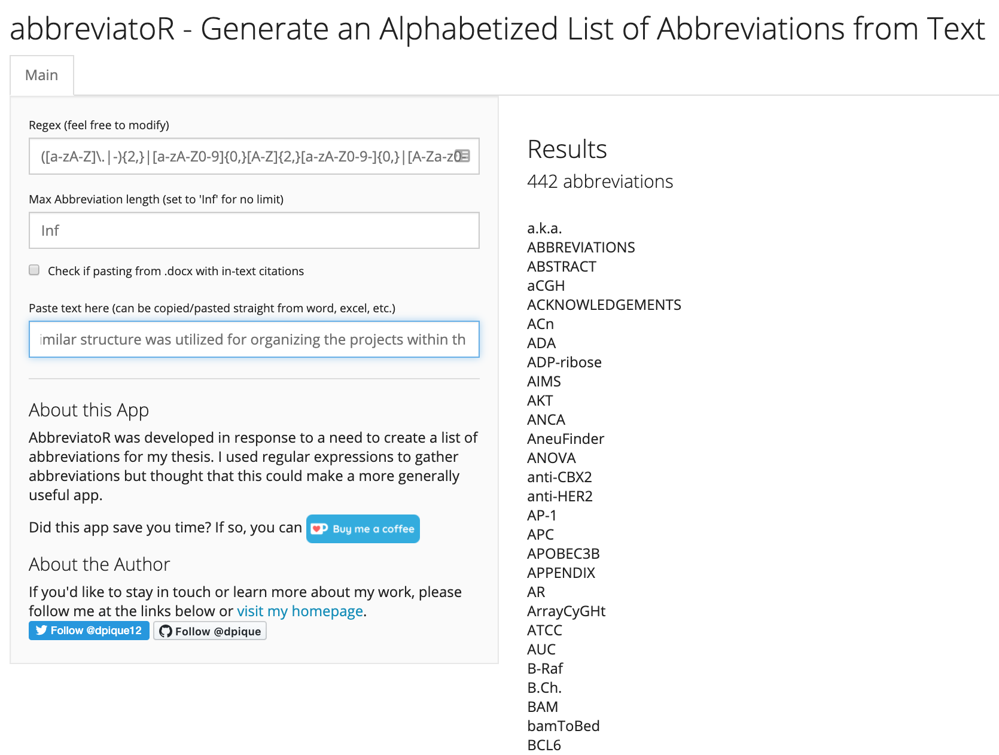

# abbreviatoR
### Automatically Generate an Alphabetized List of Abbreviations from Text

Copy-paste text straight from word, excel, or pdf into abbreviatoR! 

App is available at https://dpique.shinyapps.io/abbreviatoR/

To run abbreviatoR locally, clone this repo to your desktop and run the following commands in R:

```
install.packages("shiny")
library(shiny)

## using `setwd()`, set your working directory 
## to the "abbreviatoR" directory 
runApp()

```
Screenshot of Abbreviator UI


